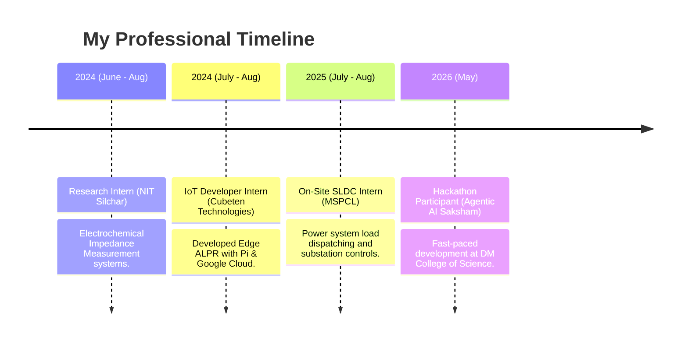

<div align="center">
  
  
  # ⚡ Laishram Llhanba
  **Electrical Engineer · IoT Specialist · Computer Vision Developer**  
  *Building where hardware meets intelligence.*

  [](https://github.com/LlenGit)
  [](https://www.linkedin.com/in/llhanba-laishram-59b5312ab/)
  [](https://www.instagram.com/llhanba_laishram/)
  [](mailto:laishramllhanba@gmail.com)

  ***

  *“A cinematic, immersive developer portfolio with a futuristic dark mode and an artistic, manga-inspired memory canvas playground.”*
</div>

---

## 📖 About Me

I am a dedicated **B.Tech student in Electrical Engineering** at **Manipur Technical University** with a deep-seated passion for **IoT (Internet of Things)** and **Computer Vision** technologies. I thrive at the intersection of hardware and software, engineering intelligent systems that act as bridges between physical electrical architectures and cognitive AI capabilities. 

### 📊 Highlight Statistics
| CGPA (MTU) | Active Projects | Internships Completed | Awards & Competitions Won |
| :---: | :---: | :---: | :---: |
| **8.00** | **4+** | **3** | **4+** |

---

## 🛠️ Technological Arsenal

### 💻 Languages & Utilities


### 🤖 AI & Computer Vision


### 🔌 IoT & Embedded Systems


### 🧠 Modern Platforms & Agents


---

## 🎨 Immersive Web-App Features

This portfolio repository isn’t just a simple page; it's a high-performance, cinematic, interactive digital artifact engineered using **React 19, Tailwind CSS v4, and Three.js / WebGL**. Key highlights include:

*   🌊 **WebGL Liquid Ripple Distortion:** The entire homepage reacts organically to mouse interactions via dynamic liquid distortion shaders, creating an immersive, fluid scroll feel.
*   📜 **Kinetic Smooth Scroll (Lenis):** Integrated with Lenis scrolling physics and customized GSAP/Framer Motion timelines for premium navigation.
*   📐 **Manga-Inspired Memory Canvas:** An interactive technical playground utilizing grainy SVG noise turbulence, customized layout algorithms, and scattered polaroid cards containing digital logs and laboratory snapshots from 2021 to 2026.
*   🎵 **Context-Aware Audio Engine:** Seamlessly transitions ambient soundscapes between the general portfolio (subtle 6% background volume) and the Memory Canvas (elevated 35% audio immersive volume) using smooth, multi-step fading calculations.

---

## 🚀 Key Engineering Projects

### 1. Vision-Based Wireless Robotic Hand
> Controlled wirelessly in real-time through precise hand gesture recognition.
*   **Core Concepts:** Embedded IoT, Computer Vision, Wireless Controls
*   **Technologies Used:** `Python`, `OpenCV`, `MediaPipe`, `Arduino IDE`, `ESP32 Microcontroller`
*   **Description:** Integrates custom Computer Vision pipelines with hardware nodes to track finger movements at pixel-level coordinates. Relays finger position arrays dynamically over a local TCP/IP socket to an ESP32 microcontroller, which commands individual servo motors on a 3D-printed robotic hand, mirroring human motion in real-time.
*   **Codebase:** [vision-based-robotic-hand](https://github.com/LlenGit/vision-based-robotic-hand)

### 2. Automatic License Plate Recognition (ALPR) System
> Automated field deployment for vehicle validation and digital OCR recording.
*   **Core Concepts:** Edge Computing, Cloud Vision APIs, System Security
*   **Technologies Used:** `Python`, `Raspberry Pi 4`, `OpenCV`, `Google Cloud Vision API`, `Express/React Web Dashboard`
*   **Description:** An edge-computed security system featuring dynamic license plate boundary detection. Captures high-definition license plate images on trigger events, offloads region-of-interest frames to the Google Cloud Vision API for deep text extraction (OCR), and populates a secure real-time web dashboard for parking/security auditing.
*   **Live Demonstration:** [ALPR Video Demonstration](https://youtu.be/wkm_uxWz4Zo)
*   **Codebase:** [ALPR-using-Goggle-Cloud-Vision-API-on-Raspberry-Pi](https://github.com/LlenGit/ALPR-using-Goggle-Cloud-Vision-API-on-Raspberry-Pi-4-with-a-web-dashboard)

### 3. Secure-Flight System
> Autonomous aerial drone system with integrated collision prevention capabilities.
*   **Core Concepts:** Robotics, Control Systems, Real-Time Hardware Processing
*   **Technologies Used:** `Python`, `Arduino`, `Distance Sensors`, `Embedded Control Loops`
*   **Description:** Engineered a robust, automated flight safety stack for multicopters. Incorporates high-frequency distance ranging sensors with custom collision avoidance logic to dynamically override manual inputs when obstacles are detected, executing automatic hover or evasive maneuvers to ensure structural integrity.

### 4. Deep Learning Brain Tumor Detection & Segmentation
> Two-stage neural network pipeline for pixel-level medical MRI diagnostics.
*   **Core Concepts:** Deep Learning, Medical Image Processing
*   **Technologies Used:** `Python`, `TensorFlow`, `Keras`, `ResNet50`, `ResUNet`, `NumPy`
*   **Description:** Developed an advanced medical imaging pipeline. Stage-1 utilizes a customized ResNet50 classifier to screen and confirm the presence of brain tumors in MRI scans. Stage-2 leverages a ResUNet architecture to generate precise pixel-level masks, segmenting boundaries to assist in tumor measurement and surgical planning.
*   **Codebase:** [Medical_Image_processing](https://github.com/LlenGit/Medical_Image_processing)

---

## 💼 Professional Experience



### 🔹 Hackathon Participant — Agentic AI Saksham
*DM College of Science, Dhanamanjuri University, Imphal | May 11 — 13, 2026*
*   Engaged in a high-intensity, 2-day workshop and hackathon focusing on Agentic AI workflows.
*   Collaborated on integrating autonomous AI agents with modern web-app frontends and cloud integrations.
*   Organized by the Ministry of Education, Government of Manipur, in partnership with Capabl.in.

### 🔹 On-Site Intern — State Load Dispatch Centre (SLDC)
*Manipur State Power Company Limited (MSPCL), Yurembam | July 21 — Aug 20, 2025*
*   Obtained practical exposure in high-voltage power system operations, transmission grid monitoring, and state-wide load balancing.
*   Analyzed SCADA interfaces, control loops, and power generation profiles for regional safety maintenance.

### 🔹 IoT Developer Intern
*Cubeten Technologies, Imphal | July 29 — Aug 31, 2024*
*   Engineered the physical deployment of the ALPR system.
*   Programmed embedded Python scripts on Raspberry Pi, tuned OpenCV thresholding filters, and linked asynchronous cloud endpoints.

### 🔹 Research Intern (IEEE Summer Internship IS3IP-2024)
*National Institute of Technology (NIT), Silchar, Assam | June 30 — Aug 15, 2024*
*   Assigned to the IEEE Student Summer Internship program focusing on hardware and instrumentation.
*   Conducted physical research and calibration of Electrochemical Impedance Measurement Systems.

---

## 🏆 Achievements & Awards

*   💡 **MASTEC Innovative R&D Project Selection (2025–2026):** Selected by the **Manipur Science & Technology Council** to receive financial assistance for innovative research and engineering prototypes.
*   🥇 **1st Prize — Creative Robo Design (INNOTECH FEST 2025):** Won first place in the Creative Robotic Design competition organized by the **Department of Science & Technology (DST), Govt. of Manipur**.
*   🏆 **Winner — World Slogan Writing (World IP Day 2024):** Recognized as the top slogan designer on World Intellectual Property Day, hosted by the **IPR-Cell, Manipur Technical University**.
*   🎓 **CSIR Quiz - JIGYASA Excellence (2018):** Attained prestigious recognition of academic excellence in the CSIR National Science Quiz during the **105th Indian Science Congress**.

---

## 🎓 Education

*   🎓 **B.Tech in Electrical Engineering**
    *   *Manipur Technical University* | **2022 — Present**
    *   Currently completing the 8th Semester.
    *   Academic Standings: **CGPA 8.00 / 10.00**
*   🏫 **Higher Secondary (12th Grade COHSEM)**
    *   *CC Higher Secondary School* | **Passed in 2022**
    *   Graduated with **First Division honors**.
*   🏫 **Secondary (10th Grade BOSEM)**
    *   *Guru Nanak Public School* | **Passed in 2020**
    *   Graduated with **First Division honors**.

---

## 👥 Leadership & Club Operations

*   🏷️ **General Secretary:** Mei Lak Ae Club (MLAC), MTU *(Sept 2024 — Present)*
    *   Directing operations, coordinating student hackathons, and fostering technical/cultural engagement.
*   🎨 **In-Charge of Design Team:** FENOMENON 2025, MTU *(April 2025)*
    *   Supervised complete visual branding, UI/UX aesthetics, and festival collateral design.
*   🎵 **Active Member:** Cultural Club VIBE *(August 2025)*
    *   Managed visual production, beats, and logistics for on-campus performances and events.

---

## 🌐 Languages, Interests & Art

### 🗣️ Languages Spoken
*   **English** (High Professional Proficiency)
*   **Meitei Mayek / Manipuri** (Native / Mother Tongue)
*   **Hindi** (Working Conversational Proficiency)

### 🎨 Creative Interests & Hobby Projects
*   **Creative Art & Ambient Music:** Passionate about digital painting and atmospheric sound design. Created **"Moonlight Dreams"**—a digital exploration of light, shadow, and nocturnal serenity.
*   **Gacha Systems & Game Mechanics:** Analytical interest in RNG algorithms, pull probabilities, and dynamic in-game reward loops.
*   **Technological Explorations:** Tinker with DIY micro-robotics, home automation, and generative AI interfaces.

---

## ⚙️ Development Guide & Local Setup

### Prerequisites
*   [Node.js](https://nodejs.org/) (v18 or higher recommended)
*   npm or pnpm package manager

### 1. Installation
Clone the repository and install all node modules:
```bash
git clone https://github.com/LlenGit/premium-portfolio.git
cd premium-portfolio
npm install
```

### 2. Environment Configuration
Create a `.env.local` file in the root directory (using `.env.example` as a template):
```env
# Gemini API credentials for server-side intelligence
GEMINI_API_KEY="YOUR_ACTUAL_GEMINI_API_KEY"

# Public App Url (injected automatically in deployment)
APP_URL="http://localhost:3000"
```

### 3. Running Locally
Launch the high-fidelity Vite development server:
```bash
npm run dev
```
Open [http://localhost:3000](http://localhost:3000) to view your cinematic portfolio.

### 4. Build and Production Preview
Compile static, minimized chunks and preview locally:
```bash
npm run build
npm run preview
```

---

<div align="center">
  <sub>Designed with ♥ by Laishram Llhanba. Built utilizing React, Vite, Tailwind CSS, Three.js, and Gemini.</sub>
</div>
